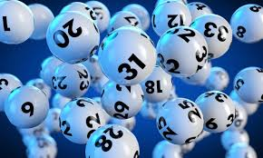
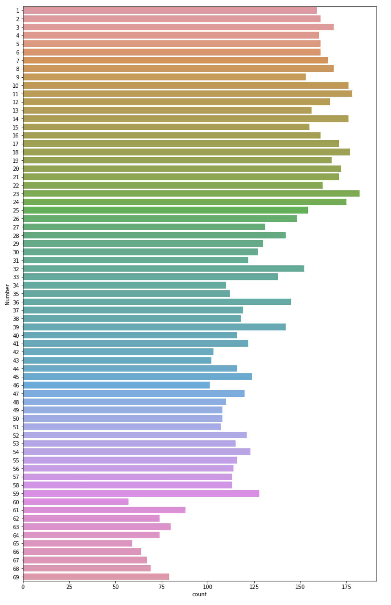
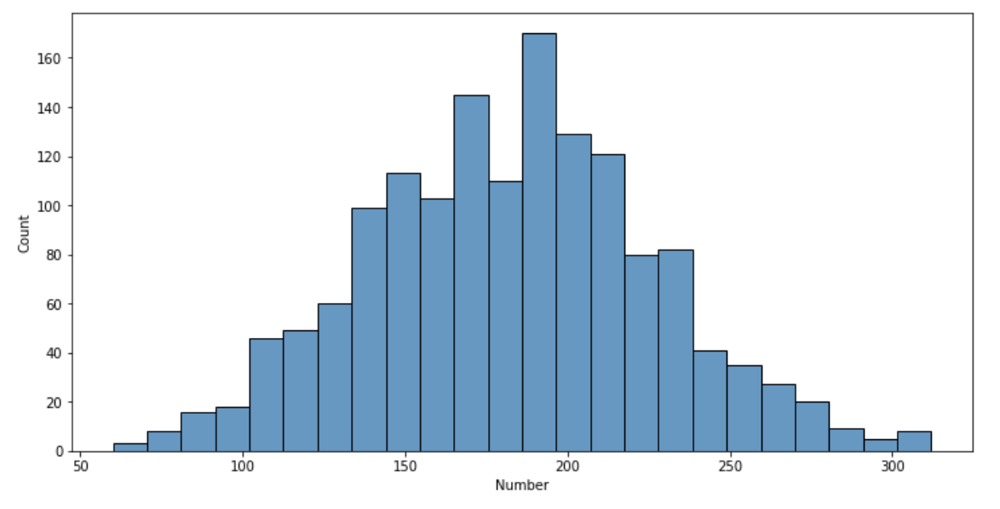

# Lottery-Number-EDA
Exploratory data analysis of winning Powerball numbers from 2010. Using historical lottery results, this Jupyter Notebook analyzes and explores the data. Several methods are used to show the realtionships within the data using Python and some of Python's best libraries for data manipulation.

### Environment
* Python 3
* Jupyter Notebook

### Libraries
* Matplotlib
* Seaborn
* Pandas



[***Data Source***](https://catalog.data.gov/dataset)

### Data Ingestion
The CSV file is read into the Jupyter Notebook using the read_csv() method. 

```
df = pd.read_csv('Lottery_Powerball_2010.csv')
```

### Data Cleaning / Transformation
The raw data contains only three attributes: the draw date, winning number combination, and the multiplier used to calculate the prize amount. The column containing the winning combination of numbers is split up to where each number has its own row for analysis with the index being reset to compensate for 6 numbers in each draw. This is completed using the split() and stack() methods. Next, the date is split into day, month, and year also using the split() method. In splitting up the winning combination column, the data type was also adjusted from a string to an integer using the astype() method. The final data frame contains the number drawn, day, month, and year of the draw and is indexed to group the combinations drawn.

### Data Visualization / Exploration
The winning number's frequency of being drawn can be shown in a bar chart using Seaborn. We can see from this that the numbers in the 60's are not drawn frequently, but those in the 20's are drawn regularly. 


We can look at it from another perspective and add up the sum of all winning combinations. We can compare the distribution of these totals in a histogram chart. From this we can see that the combination of numbers that won the majority of the time totaled about 183 when added together. The range of winning combinations mostly fell between 175 and 200 when summed. 


The question always remains of what the next winning combination will be. Let's use the value_counts() method to find the 6 most and least frequently drawn numbers.


Good luck on your next game!
